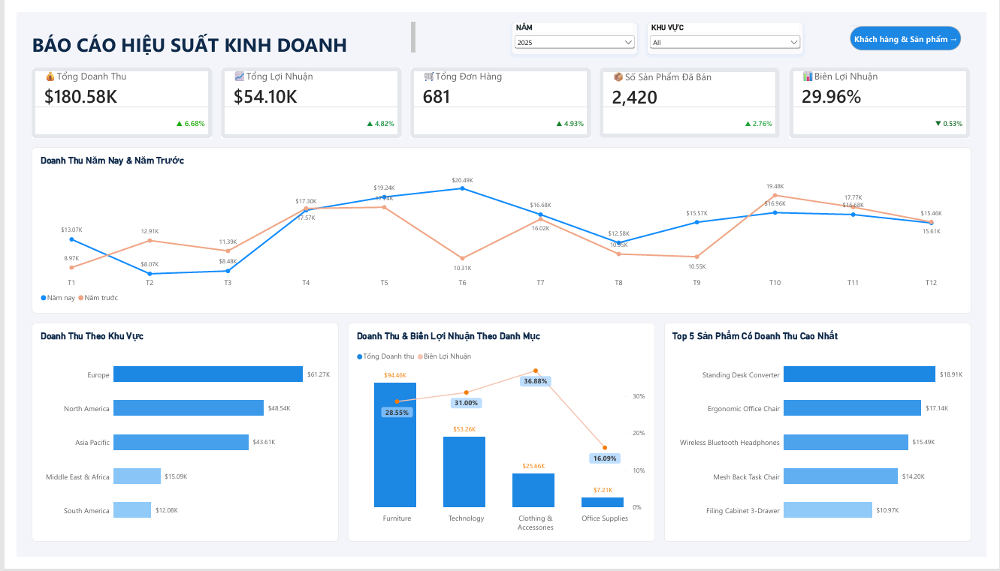
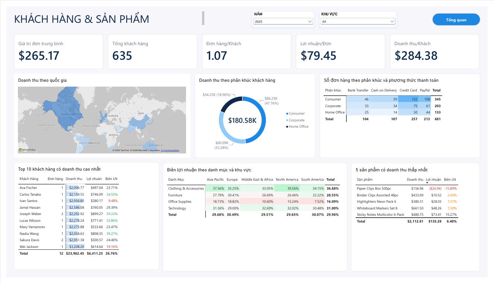

# Global E-commerce Sales Dashboard (Power BI)

Dashboard phân tích hiệu suất kinh doanh thương mại điện tử toàn cầu, xây dựng bằng **Power BI Desktop**. Báo cáo gồm 2 trang: **Tổng quan** (hiệu suất kinh doanh) và **Khách hàng & Sản phẩm** (ai mua, mua ở đâu, mua bằng cách nào, sản phẩm nào cần chú ý).


---

## Ảnh chụp dashboard

| Trang 1: Tổng quan | Trang 2: Khách hàng & Sản phẩm |
|---|---|
|  |  |

---

## Mục tiêu dự án
Mục tiêu chung: xây dựng dashboard theo dõi hiệu suất kinh doanh thương mại điện tử toàn cầu, giúp phát hiện điểm mạnh, điểm yếu và hỗ trợ quyết định về khu vực, danh mục, sản phẩm và khách hàng.
Mục tiêu cụ thể:

1. Theo dõi các chỉ số chính (doanh thu, lợi nhuận, đơn hàng, số sản phẩm đã bán, biên lợi nhuận) và so sánh với năm trước.

2. Nhận biết xu hướng của doanh thu theo tháng.

3. Đánh giá đóng góp doanh thu và biên lợi nhuận theo khu vực, danh mục và sản phẩm.

4. Hiểu cơ cấu khách hàng: phân khúc, phương thức thanh toán, quốc gia và nhóm khách hàng lớn.

---

## Đối tượng sử dụng

| Đối tượng | Câu hỏi họ quan tâm | Phần dashboard phù hợp |
|---|---|---|
| **Ban giám đốc, quản lý cấp cao** | Doanh thu, lợi nhuận, biên lợi nhuận và tăng trưởng so với năm trước ra sao? | Trang 1: 5 thẻ KPI, biểu đồ xu hướng |
| **Quản lý kinh doanh theo khu vực** | Khu vực nào mạnh, khu vực nào yếu? Thị trường nào tập trung doanh thu? | Trang 1: biểu đồ khu vực. Trang 2: bản đồ quốc gia |
| **Quản lý ngành hàng, mua hàng** | Danh mục nào lãi cao, lãi thấp? Sản phẩm nào cần xem lại giá hoặc chi phí? | Trang 1: biểu đồ danh mục, Top 5. Trang 2: ma trận biên lợi nhuận, bảng sản phẩm doanh thu thấp |
| **Marketing, chăm sóc khách hàng** | Phân khúc nào đem lại nhiều doanh thu? Khách hàng nào quan trọng nhất? | Trang 2: donut phân khúc, Top 10 khách hàng |
| **Tài chính, kế toán, vận hành thanh toán** | Khách thanh toán bằng phương thức nào? Giá trị đơn trung bình? | Trang 2: ma trận phương thức thanh toán, thẻ AOV |
| **Nhà phân tích dữ liệu, người học Power BI** | Mô hình dữ liệu, DAX time intelligence, định dạng có điều kiện được làm như thế nào? | Toàn bộ file `.pbix` và thư mục `dax/` |

---

## Các loại biểu đồ và lý do chọn

### Trang 1: Tổng quan

| Visual | Loại biểu đồ | Dữ liệu | Vì sao chọn |
|---|---|---|---|
| 5 thẻ KPI | Card | Tổng doanh thu, lợi nhuận, đơn hàng, số sản phẩm đã bán, biên lợi nhuận, kèm mức thay đổi so với năm trước | Nhìn nhanh sức khỏe kinh doanh |
| Doanh thu năm nay và năm trước | Line chart (2 đường) | Doanh thu theo tháng, so sánh cùng kỳ | Thể hiện xu hướng và mùa vụ, dễ so sánh hai năm |
| Doanh thu theo khu vực | Bar chart ngang (sắp giảm dần) | Doanh thu theo khu vực | So sánh các hạng mục có tên dài, dễ xếp hạng |
| Doanh thu và biên lợi nhuận theo danh mục | Line and clustered column chart (cột và marker, trục phụ) | Doanh thu (cột) và biên lợi nhuận (marker) | Đặt hai thước đo khác đơn vị cạnh nhau để thấy danh mục bán nhiều nhưng lãi thấp |
| Top 5 sản phẩm có doanh thu cao nhất | Bar chart ngang với bộ lọc Top N | 5 sản phẩm có doanh thu cao nhất | Tập trung vào nhóm đóng góp lớn nhất |
| Bộ lọc | Slicer dạng dropdown (Năm, Khu vực) | | Cho phép xem theo từng năm và khu vực |

### Trang 2: Khách hàng và Sản phẩm

| Visual | Loại biểu đồ | Dữ liệu | Vì sao chọn |
|---|---|---|---|
| 5 thẻ KPI | Card | AOV, tổng khách hàng, đơn hàng trên mỗi khách, lợi nhuận trên mỗi đơn, doanh thu trên mỗi khách | Chỉ số về hành vi khách hàng |
| Doanh thu theo quốc gia | Filled map (tô màu theo doanh thu) | Doanh thu theo quốc gia, tooltip có lợi nhuận và biên lợi nhuận | Thấy phân bố địa lý trong một cái nhìn |
| Doanh thu theo phân khúc khách hàng | Donut chart | Tỷ trọng doanh thu theo phân khúc khách hàng | Ít hạng mục (3 phân khúc), phù hợp để thể hiện tỷ trọng |
| Số đơn hàng theo phân khúc và phương thức thanh toán | Matrix với nền gradient (heatmap) | Số đơn theo phân khúc và phương thức thanh toán | Ô đậm màu cho thấy tổ hợp phổ biến |
| Top 10 khách hàng có doanh thu cao nhất | Table với data bars và quy tắc màu chữ | Doanh thu, lợi nhuận, biên lợi nhuận của 10 khách hàng có doanh thu cao nhất | Xem chi tiết từng khách, biên dưới 20% hiện màu đỏ |
| Biên lợi nhuận theo danh mục và khu vực | Matrix với nền gradient đỏ, trắng, xanh | Biên lợi nhuận theo danh mục và khu vực | Phát hiện ô lãi thấp trong một cái nhìn |
| 5 sản phẩm có doanh thu thấp nhất | Table với quy tắc màu | Doanh thu, lợi nhuận, biên lợi nhuận | Phát hiện sản phẩm lỗ (số âm hiện màu đỏ) |

---

## Mô hình dữ liệu

Mô hình dạng **star schema** đơn giản:

```
Date (1) ───────< (*) global_ecommerce_sales
 [Date]                [Order_Date]

Measure Group 
```

- **global_ecommerce_sales** : Order_ID, Order_Date, Customer_Name, Customer_Segment, Country, Region, Product_Category, Product_Name, Quantity, Unit_Price, Payment_Method
- **Date** : tạo bằng DAX, được đánh dấu là Date table, quan hệ 1-nhiều với `Order_Date`. 
- **Measure Group**: gom toàn bộ measure, chia thư mục hiển thị (Core, Last Year, % Change, Format).

---

## Các measure chính (DAX)

Nhóm cơ bản: `Total Sales`, `Total Profits`, `Total Orders`, `Total Quantities`, `Profit Margin`.

**Cùng kỳ năm trước và tăng trưởng:**

```DAX
Sales Last Year =
CALCULATE([Total Sales], SAMEPERIODLASTYEAR('Date'[Date]))

% Change Sales Last Year =
DIVIDE([Total Sales] - [Sales Last Year], [Sales Last Year])
```

Các measure `Profit Last Year`, `Orders Last Year`, `Quantity Last Year`, `Profit Margin Last Year` và các measure `% Change ...` được viết cùng cách.

**Chênh lệch biên lợi nhuận (trả về blank khi chưa có năm trước):**

```DAX
Profit Margin YoY =
VAR LY = [Profit Margin Last Year]
RETURN
    IF(ISBLANK(LY), BLANK(), [Profit Margin] - LY)
```

**Định dạng hiển thị mũi tên tăng giảm trên thẻ KPI:**

```DAX
% Sales Format =
VAR _val = [% Change Sales Last Year]
RETURN
    IF(
        ISBLANK(_val),
        BLANK(),
        IF(
            _val >= 0,
            "▲ " & FORMAT(_val, "0.00%"),
            "▼ " & FORMAT(ABS(_val), "0.00%")
        )
    )

% Profit Margin Format =
VAR Change = [Profit Margin YoY]
RETURN
    IF(
        ISBLANK(Change),
        BLANK(),
        IF(
            Change >= 0,
            "▲ " & FORMAT(Change, "0.00%"),
            "▼ " & FORMAT(ABS(Change), "0.00%")
        )
    )
```

**Chỉ số khách hàng (Trang 2):**

```DAX
Total Customers = DISTINCTCOUNT(global_ecommerce_sales[Customer_Name])
AOV = DIVIDE([Total Sales], [Total Orders])
Orders per Customer = DIVIDE([Total Orders], [Total Customers])
Profit per Order = DIVIDE([Total Profits], [Total Orders])
```

---

## Nhận định chính

Số liệu dưới đây tính trên toàn bộ dữ liệu (khoảng 3 năm, 2,000 đơn hàng):

- Tổng doanh thu **530.47K**, lợi nhuận **158.87K**, biên lợi nhuận **29.95%**, AOV **265.24**, khoảng **1,534** khách hàng.
- **Furniture** có doanh thu cao nhất (280.85K) với biên 28.90%. **Clothing & Accessories** có biên cao nhất (34.43%). **Office Supplies** có biên thấp nhất (15.61%) và là danh mục lãi thấp nhất ở cả 5 khu vực, thấp nhất tại Middle East & Africa (6.94%).
- **Europe** dẫn đầu doanh thu theo khu vực (149.82K), sát với North America (146.22K). Thứ hạng khu vực thay đổi theo năm: năm 2023 Asia Pacific dẫn đầu.
- Phân khúc **Consumer** chiếm khoảng 52% doanh thu; **Credit Card** chiếm khoảng 40% số đơn hàng.
- **Top 10 khách hàng** chỉ chiếm khoảng 6% doanh thu, cho thấy doanh thu phân tán, không phụ thuộc vào vài khách lớn.
- Một số sản phẩm doanh thu thấp đang bán lỗ (ví dụ Paper Clips Box 500pc, Highlighters Neon Pack 6), cần xem lại giá hoặc chi phí.

### Lưu ý khi đọc các chỉ số tăng trưởng

Các chỉ số so với năm trước chỉ có ý nghĩa khi **chọn một năm cụ thể** ở slicer Năm. Khi để "All", phép so sánh sẽ lấy toàn bộ dữ liệu so với phần còn lại của năm trước nên cho kết quả sai lệch. Năm đầu tiên của dữ liệu (2023) chưa có năm trước nên các thẻ tăng trưởng hiển thị "--".
---

## Cách sử dụng

1. Cài **Power BI Desktop** (bản mới nhất).
2. Mở file `dashboard/ecommerce-sales.pbix`.
3. Chọn **Năm** ở slicer để xem số liệu và tăng trưởng so với năm trước.
4. Chọn **Khu vực** để lọc theo thị trường.
5. Dùng nút **"Khách hàng & Sản phẩm →"** và **"Tổng quan"** để chuyển trang.
6. Bấm vào một cột hoặc ô trong biểu đồ để lọc chéo các visual khác. Bấm vào vùng trống để bỏ chọn.

---

## Cấu trúc repo

```
global-ecommerce-sales/
├── images/
│   ├── page_1.png
│   └── page_2.png
├── README.md
├── ecommerce-sales.pbix
```
---
## Nguồn dữ liệu
- Dataset: **global-ecommerce-sales** — Dữ liệu được lấy trên Kaggle.
## Công cụ
- Power BI Desktop (Power Query, DAX, mô hình dữ liệu, định dạng có điều kiện)
## Tác giả
Võ Tấn Tài - taitanvo16@gmail.com
